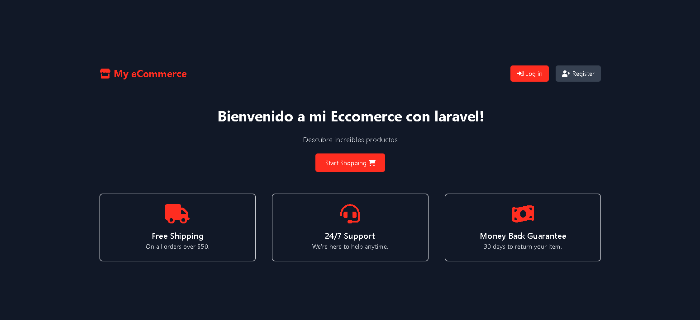
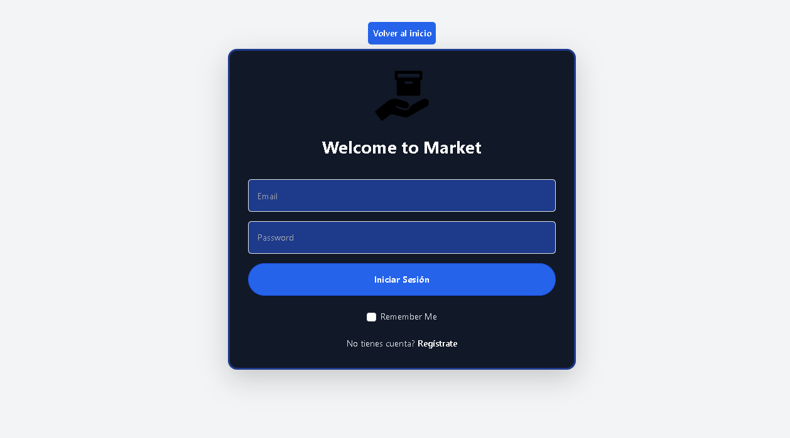
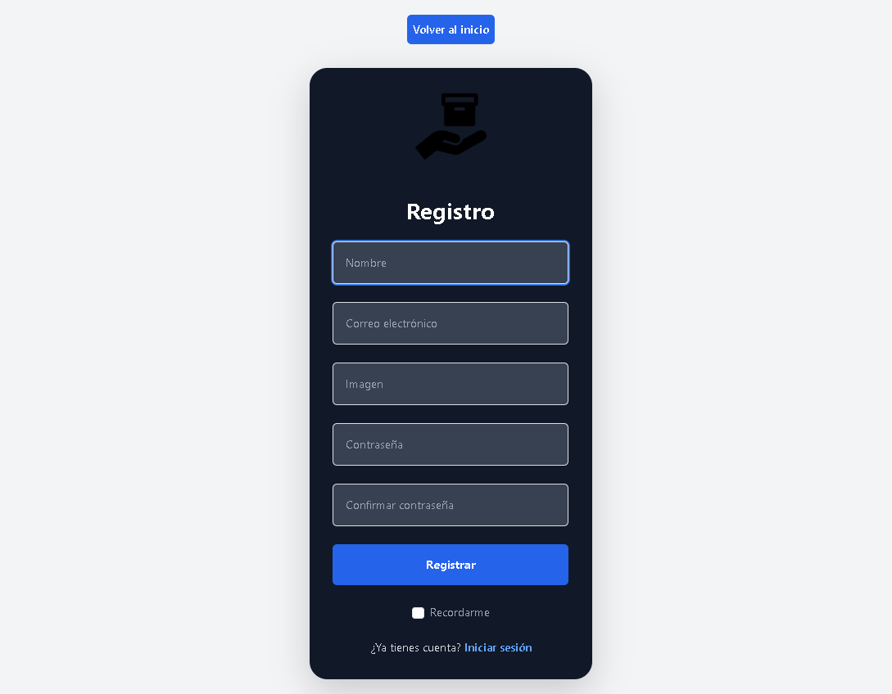

# eCommerce con Laravel

Este es un eCommerce construido con Laravel y Bootstrap, utilizando MySQL como base de datos. La aplicación ya viene con datos de ejemplo, solo necesitas ejecutar el *seed* para cargar la información inicial.

## Estructura de la Aplicación

La aplicación está estructurada de la siguiente manera:

### Inicio (Home)
Aquí te damos una cordial bienvenida y una visión general de la tienda.



### Ingreso (Login)
Esta es la sección donde los usuarios pueden iniciar sesión para acceder a sus cuentas y ver sus compras anteriores. La aplicación incluye datos de ejemplo para facilitar la navegación.



### Registro (Register)
En esta sección, los nuevos usuarios pueden registrarse para crear una cuenta en la aplicación.



### Panel de Control (Dashboard)
Aquí se pueden ver los productos disponibles, así como las opciones para editar, eliminar y crear nuevos productos.


### Crear Producto (Create)
En esta sección, los usuarios pueden registrar nuevos productos. También se pueden editar los productos existentes desde aquí.


### Carrito de Compras (Cart)
Este es el carrito de compras donde se muestran los productos seleccionados anteriormente desde el Panel de Control, listos para ser comprados.


## Configuración y Ejecución

Para configurar la base de datos y ejecutar la aplicación, sigue estos pasos:

1. **Clona el repositorio**:
   ```bash
   git clone <URL-del-repositorio>
   cd <nombre-del-repositorio>
   ```

2. **Instala las dependencias**:
   ```bash
   composer install
   ```

3. **Crea la base de datos**:
   - Abre tu consola de MySQL y ejecuta:
   ```sql
   CREATE DATABASE nombre_de_la_base_de_datos;
   ```

4. **Configura el archivo `.env`**:
   - Asegúrate de que el archivo `.env` tenga los detalles correctos de la conexión a la base de datos:
   ```plaintext
   DB_CONNECTION=mysql
   DB_HOST=127.0.0.1
   DB_PORT=3306
   DB_DATABASE=nombre_de_la_base_de_datos
   DB_USERNAME=tu_usuario
   DB_PASSWORD=tu_contraseña
   ```

5. **Ejecuta las migraciones**:
   ```bash
   php artisan migrate
   ```

6. **Ejecuta el seed para cargar datos de ejemplo**:
   ```bash
   php artisan db:seed
   ```

7. **Ejecuta la aplicación**:
   ```bash
   php artisan serve
   ```

Ahora puedes acceder a la aplicación en `http://localhost:8000`.

